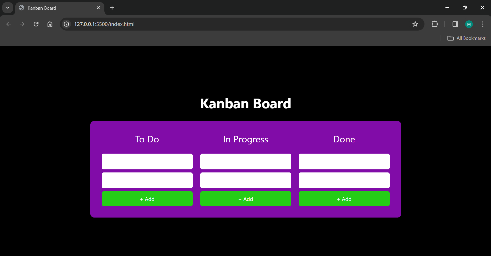
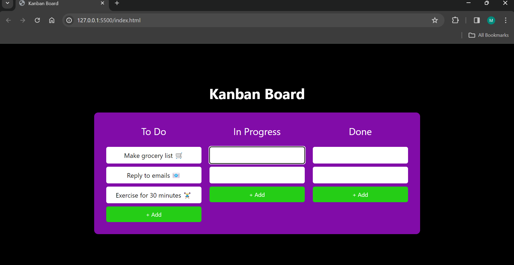
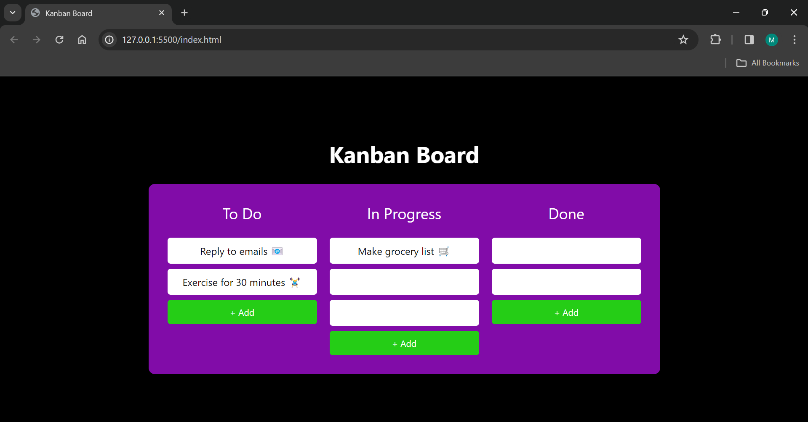
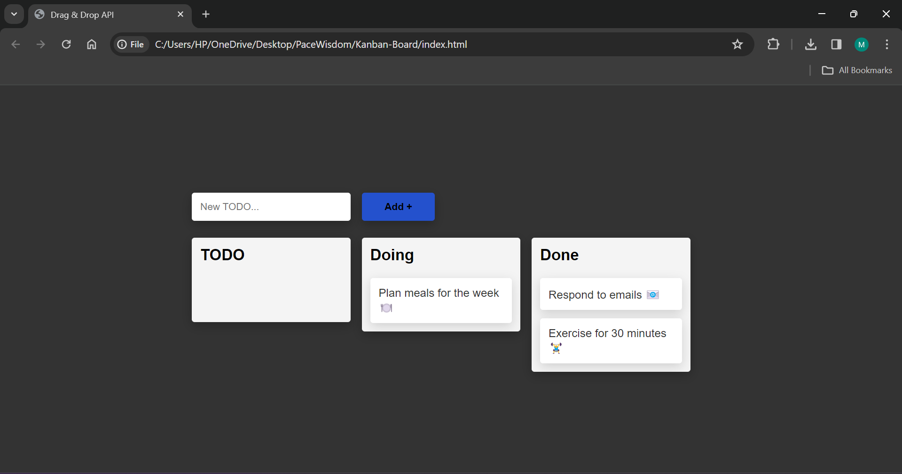

# Kanban-Board

This is a simple Kanban Board implemented using HTML, CSS, and JavaScript.

## Overview

The Kanban Board allows you to organize tasks into columns representing different stages of your workflow. It provides a visual representation of work items, making it easier to track progress and manage tasks efficiently.

## Features

- Drag and drop tasks between columns.
- Add new tasks dynamically.
- Intuitive interface for easy task management.
- Delete tasks after completing the chores.

## Screenshots

### Kanban Board Interface

### Adding a New Task

### Moving Tasks Between Columns

### Deleting a Task

## Usage

To use the Kanban Board, simply open the `index.html` file in your web browser. You can add new tasks by clicking on the "Add Task" button and drag tasks between columns to update their status.

## Contributing

Contributions are welcome! Here's how you can contribute:

1. Fork the repository.
2. Create a new branch (`git checkout -b feature/your-branch-name`).
3. Make your changes.
4. Commit your changes (`git commit -am 'Add new feature'`).
5. Push to the branch (`git push origin feature/your-branch-name`).
6. Create a new Pull Request.

## Credits

This project was created by .
